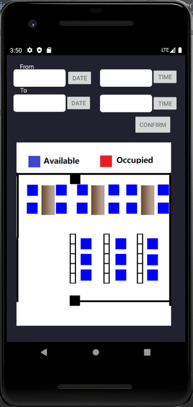
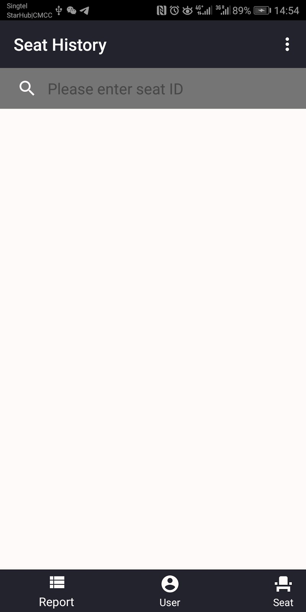
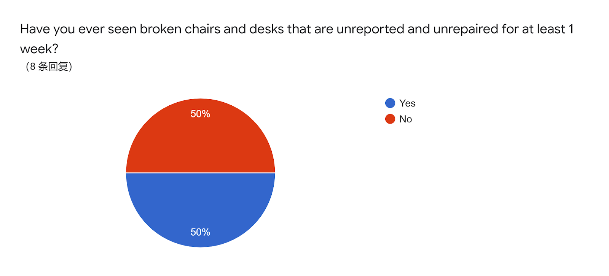

# PLACEHOLDER

This is our [User Guide][user_guide_link]

[user_guide_link]: https://docs.google.com/document/d/1FMXvJDfR317MMvIS8GhGa767Y2BGIKwghsiiBjQqe7o/edit?usp=sharing

This is our [Developer Documentation][developer_documentation_link]

[developer_documentation_link]: https://docs.google.com/document/d/1rDCk5b-37iUtC_ukMMJ9mBYUjD_7yZ-IznuXTgZLnm4/edit?usp=sharing

This is our [Video Demo][video_demo_link]

[video_demo_link]: https://youtu.be/prnHBllxngA

This is the [Entity-Relationship Diagram][er_diagram] of our application

[er_diagram]: https://drive.google.com/file/d/1Wu5GDG2Y-l6dHqrbQRWGOF2S_3v68o44/view?usp=sharing

**Project scope:**

**Short version:** A study space booking application on android platform

**Long version:**

The project is a study space booking android application developed for students to book seats in NUS libraries and for the NUS library management office to better manage the study spaces. The first stage is to develop the application using a local SQLite database and implementing basic features including sign-in, sign-out, and booking. In the second stage, other core features such as the credit system and user-management policies would be implemented and we would use an online server and firebase instead.

**Target Users:** NUS Students and NUS Library Management Office

**Problem motivation:**

1. Students often seem to have trouble finding seats in the study space in NUS. There are several reasons accounting for this. Firstly, there is a high demand for study space among the students, while the study space on campus is limited to a few locations such as the central library and ERC. Secondly, there seems to be a common practice of chopping seats using personal belongings among the students, which further increases the difficulty to find a free seat which is neither occupied by any students or their belongings.

2. Another problem is that some equipment in the study rooms does not seem to have been well maintained, such as light and sockets. This can affect the user experience. However, it might be a bit troublesome for the students themselves to report these problems to the office on time.

3. Based on these observations, we propose to create a mobile application. This application should enable students to find free seats and make bookings in advance. This feature can make finding free seats less troublesome and time-consuming. Additionally, this application should provide a platform for students to report maintenance problems. This feature can help administrators to identify maintenance problems and improve user experience. We also plan to establish a credit record system to keep track of misconduct of the students when using these facilities, such as seat chopping, to regulate the student behaviour. Additionally, the reason why we choose to build a mobile application is that a mobile application is usually convenient to use and students can make bookings whenever and wherever they want.

**User Story:**

1. As a student who wants to find a seat in the ERC study or central library, I want to be able to check whether there are vacancies and book seats in advance without having to spend time going to the specific locations.

1. As the administrator from the management office, I want to be able to get reports from users on the broken facilities and plan the repairing and maintaining process to take place.
2. As an administrator who wants to eliminate the behaviour of occupying seats, I want to be able to identify abusers who do not come even though they have booked seats, warn them and ban them from booking seats if they continue to behave in this way.

**Core features:**

**Students:**

1. Sign in

 

2. Register

Students need to register with the school email address

The password needs to have at least 1 character and 1 digit

  

3. Select a certain study space, such as PC Commons in University Town, and set the start time and end time for their booking to view the vacancies in that particular study space and time slot.

The user can only book one seat during a period of time.

 

 

4. Choose a vacant seat and make a booking based on the seat and timeslot selected, and confirm the booking

5. Sign in to the booked seat within 15 minutes of the scheduled starting time of the booking by scanning QR code. If the signing in is too late, the booking will be eliminated by the system.

 

6. Sign out to the booked seat within 30 minutes of the scheduled end time of the booking by scanning QR code

7. Leave temporarily by scanning the QR code. The student needs to come back within 0.5 hour and sign in again by scanning the QR code.

8. View future bookings to remind the students to sign in to the seat on time, and call off the booking if necessary

9. View the credit record

10. View the booking history

11. Submit a problem report with a photo and a short description within 50 words.

The problem report should be related to the maintenance of equipment in the study space.

12. View all the problem report posted and leave a comment if necessary

The problem report should be related to the maintenance issue in the study space. The example below is only for demonstration.

 

 

**Credit System:**

1. The student will be given 10 credit points initially, and 1 point will be deducted for every misconduct, such as being unable to show up for the booking. The credit points will be refreshed monthly.

1. Students must sign in by scanning QR code within 15 minutes, or the booking would be cancelled and 1 point would be deducted.

1. Students must leave by scanning QR code within 30 minutes from the end of their booking period, or 1 point would be deducted.

1. Leave temporarily: Scan the QR code and choose to leave temporarily, the user needs to come back in 0.5 hours and sign-in by scanning the QR code. If the user did not manage to come back and rescan the QR code within 30 minutes, 1 point would be deducted.

1. Submit problem report with a photo and a short description. If the problem report is valid and reviewed by admins, the admin will add 1 credit to the user.

1. The user would be blocked when credit is 0 and has to wait for next month to refresh the credit.

**Administrators:**

1. Sign in

2. Search for a user to see the credit record and booking history according to the name of the user

 

3. Search for a user to see the credit record and booking history according to the id of the user

4. View the problem reports, change the status of the report, leave a comment, and delete the report if necessary

 

5. Search for a seat to see the booking history of the seat according to the id of the seat

 

**Necessary Technologies Involved:**

1: Git

2. Android Studio

3. Java

4. SQLite

5. Material Design

6. Firebase

**Testing:**

The testing used so far is primarily system testing, which means many of the testings are done by the developers. However, we have also invited ten NUS student users to have done alpha testing for our application.

**System testing:**

Testing log:
1. It was found that there could be duplicate user accounts with the same school email address. This problem is addressed by imposing more restrictions on the registration and sign-in process.
2. The time format for the pending bookings shown in the user home page is previously not correct. The booking start time and booking end time are stored in the database in the form of an offset of seconds from a specific time point in the past. It was found that there was an overflow issue when the time in the database is retrieved and converted to milliseconds. This problem is solved by using long integer instead of a normal integer.
3. For the retrieval of problem report from firebase, it was found that firebase methods work asynchronously, and the result returned sequentially after the method call will have empty content. This problem is solved by using the listener.
4. For the submission of problem report, it was found that a user may click the submit button multiple times after the first click, which will result in duplicate reports submitted. This problem is solved by preventing submitting one report in the process of submitting another report.
5. For the user interface of the registration, the text fields were originally too long and occupied the entire width space of the page. This problem is solved by adding constraints to the left and right of the text area.
6. For the seat booking activities, originally we did not think of what if a user book a seat at overlapping timeslots at two different places. We solved this problem by adding more restrictions to the booking seat activities.
7. For the alert dialogues shown in the app, we found that the default theme was not suitable for us when we changed our theme to the dark theme. Thus, suggested by our test users, we implemented personalized alert dialogue themes.
8. For the bookings list views, users suggested that instead of plain text, we can also add a picture of the library that the seat is located at. This is convenient for some users who might not be so familiar with the library. Thus, we have implemented a photo of the specific library that match the location of the booking.
9. As for the admin activities, we also faced a privacy issue. As admins could look up the using history of a certain seat. Users might not want admins to directly see their student numbers by looking up the history of a certain seat. Thus, we let admins only see user IDs instead of user names. We have also rewrite the user searching activity so that admins can also deduct points of a certain user if either user ID or user name is known.
10. For the UI of the application. At first, we used the default UI design, however, we found that a darker UI seems to be a better design. The dark colour theme looks better. Thus we tried out different colour combinations and decided to implement the dark colour theme instead.

**Qualitative testing:**

The qualitative testing aims to evaluate the user experience of the application and find potential space for improvement by collecting data using a pre survey form and post survey form. 
The pre survey form requires the user to indicate the problems they encountered in campus study space, as well as their demand and expectation for an application that aims to solve these problems. The consent for collection of personal information is given by the users at the beginning of the pre survey form.
The post survey form aims to collect information regarding the user experience and suggestions on how the application can be improved. 

*Result and analysis:*

Pre survey:

1.

The tested users come from School of Computing, Faculty of Engineering, and Business School. This may introduce some biases since the demand for study space in University Town may differ among faculties.

2.

Over half of the tested users are freshmen.

3.

The statistics show that the most of the users have demand for using the study space in University Town.

4.

Most of the users seem to have encountered difficulties in finding available seats. The possible reasons can be overcrowdedness and seat chopping.

5.

Most of the users indicate that they have encountered seat chopping at a relevant frequency. Combined with question  3 and question 4, it can be seen that there seems to be a high demand for a study space booking application, which can prevent the problems of seat chopping and making it easier to find seats. 

6.

Half of the users have encountered equipment maintenance problems in the study space, which is a quite significant percentage. This indicates that there is a real need for an application that allows users to submit problem reports.

7.

Almost all the users agree that seat finding and seat booking is necessary, which verifies the high demand for the seat booking functionality. Additionally, most of the users agree that the problem report functionality is necessary, which shows a relevant need for users to be able submit report in the application.

8.

Most of the users agree to use the application for study space booking on campus.

Post survey:

1.

All the users agree that it is easy to get started with the application.

2.

All if the users gave a rate of 7 or higher. Most of the users give high ratings because they think the seat booking functionality is useful and convenient, as indicated in the comment section of this question.

3.

All of the users gave a rating of 7 or higher. Most of the users think the problem report functionality gives the study space managers a brief and comprehensive description of the maintenance problem as indicated in the comment section of this question. 

4.

Nearly half of the users think that the user interface can be better. Many of them suggested that an alternative colour palette, such as the NUS palette.
Some of the users also think that the user interface for the authentication can be improved. 

5.

All of the users gave a rating of 7 or higher. Most of the users think the application is useful. Some of the users suggested additional features such as user profile and customized user photo. There are also suggestions on the user interface regarding the color palette and alignment as indicated in the comment section of this question.

*Summary:*

According to the statistics, there is a high demand for an application that allows users to book seats in advance and submit problem report regarding maintenance issues when necessary, as is shown by the pre survey. The post survey shows that the placeholder application is able to satisfy these demands at least on a basic level. However, there are still many issues affecting the user experience, such as lack of user profile, and problems regarding the user interface. These issues will be addressed in the progress of further testing and adjustment.
